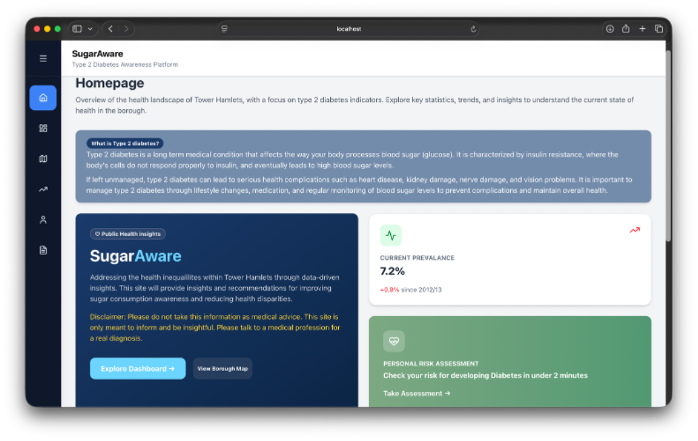
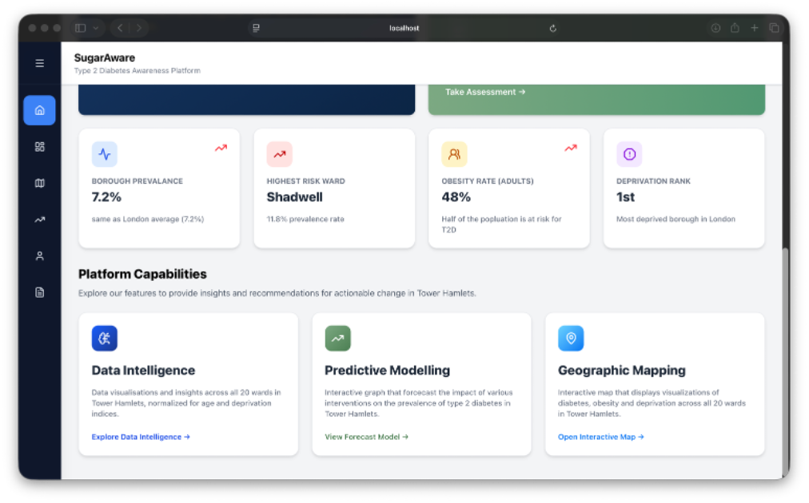
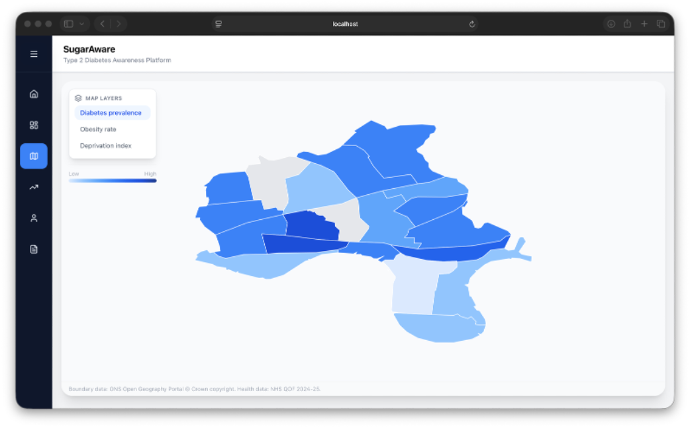
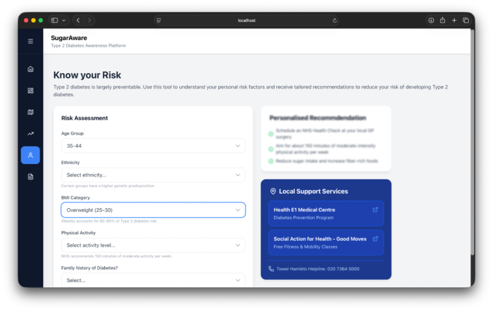

# Expermental Data Science Project

Expermental Data Science Project


This project is an data science project that focuses on bringing awareness and knowledge about Diabetes to Tower Hamlets. The project uses multiple screens-and graphs-with a nav bar.


**Link to Project:**











## **How it was made:**

**Tech used:** TailwindCSS, JavaScript, React + vite, Python, icons from lucicide-react


Back-end: 

Raw Data was procerssed through python scripts to makee a processed data (Json)

Front End:

The project was made by using React + vite as the skeleton. Once the data was processed everything would go to App.jsx for any screen and such. A homepage was made to show the overview fdor the project. A dashboard page was create to showcase data about risk corleation, prevalance in each ward, and a 5 year trend chart. Ann interactrive map was created to showcase the different data of obesity, diabetes, and deperivation in different wards and how they compared to each other.  A predicitive modelling page was created to show a 5 year treand with diabetes and what'll look like if an intervention does happen comparted to if it doesn't. ALSO, A Risk Assessment page was created, which allows the user to trake a risk assessment that based on pointage for the scoring system. But it will let the users know what their risk level is and give them recommendations. There is a recommendations page that give persoanl and community recommendations overall.


## Set-up

```bash
# Clone this repository
# Install Node dependencies
npm ci


# Create and activate Python virtual environment
python3 -m venv .venv
source .venv/bin/activate


# Install Python dependencies
python3 -m pip install --upgrade pip
pip install pytest pytest-cov pandas openpyxl
```

## Testing


### Frontend Tests (React + Vitest)


```bash
# Run all frontend tests
npm run test


# Run with UI dashboard
npm run test:ui


# Generate coverage report
npm run test:coverage
```

### Python Tests (pytest)


```bash
# Activate Python environment first (if not already active)
source .venv/bin/activate


# Run all Python tests
npm run test:py


# Generate coverage report (excludes test files)
npm run test:py:coverage
```


## **Lesson Learnt:**


Overall, this project was very fun to create. Some lessons i have learnt from this is that data is not easy to use to code with. I sturuggled with trying to get the data correctly into files and into the graphs. But it was fun to successed.
